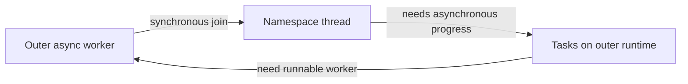

# Network namespace thread join and startup stall

[Fix inventory](README.md)

Fix: `6e2a5b2c22f3`. Reduction that preceded the observed stall: `85a851063ac8`.
The distinction between a demonstrated scheduling defect and its suspected trigger
is important: the history does not establish that one deleted API call alone caused
all observed failures.

## What changed before the stall?

The reduction removed a duplicate Firecracker `PUT /vsock` resource operation.
VM preparation still configured the real hybrid-vsock transport. Resource setup
previously processed HybridVsock, Network, then VmRootfs; afterward it processed
Network, then VmRootfs. This removed an await/API exchange before network setup.

Network namespace work already used a dedicated OS thread with its own
current-thread Tokio runtime. The outer async runtime synchronously joined that
thread. If work performed by the namespace thread needed progress from tasks on
the outer runtime, the join could occupy the worker needed to make that progress.
The lockstep was possible before the reduction; changing the preceding scheduling
could expose it. No single-deletion A/B experiment proved the duplicate vsock call
was the sole trigger.

## The wait dependency

The correction wraps the dedicated thread's join in `tokio::task::spawn_blocking`
and awaits the blocking task. The outer worker can then run other asynchronous
work. The dedicated namespace thread is retained: namespace-sensitive execution
must not migrate freely between arbitrary async workers.

The helper returns ordinary work errors and reports a thread panic or join failure
as an error. Awaiting a blocking task is not cancellation of the underlying work:
dropping the awaiting future does not forcibly stop the thread.

## Why did an API timeout not explain everything?

The Firecracker API already had a ten-second timeout, and the namespace runtimes
already had timers enabled by `a0e17099d2b4`. That earlier change repaired a different
regression: newly added deadlines panicked under runtimes that enabled only I/O.

With timers enabled, waiting solely for an HTTP response should eventually fail,
provided the relevant runtime is making progress. The indefinite observed stall
therefore cannot be attributed confidently to that simple case alone. It could
involve a dependency before the deadline or another scheduling wait. The exact
pending production future was not captured.

## Evidence and limits

A deterministic one-worker synthetic regression required progress on the outer
runtime while the namespace thread was being joined. The old join failed the
five-second progress bound; the awaited blocking bridge passed. A second test
checked returned errors and panic handling. The real runtime had multiple workers,
so this reproducer proves the scheduling hazard, not the exact production schedule.

Before the correction, one traced workload completed while several untraced
workload checks stalled before boot. Those results are consistent with timing
sensitivity but do not by themselves identify the cause. After correction,
startup, raw-block, termination-message, multiple-volume and tracing checks passed.
The multiple-volume behavioral assertions passed, but its cleanup waiter returned
a failure and cleanup was verified separately; that script is not described as an
unqualified end-to-end success.

This explanation summarizes the original development evidence. Publication did not
rerun a VM or privileged test. It preserves the uncertainty instead of turning a
plausible scheduling trigger into a proven causal claim.

## Source

- [Thread bridge and regressions](../../src/runtime-rs/crates/resource/src/manager_inner.rs)
- [Sandbox resource order](../../src/runtime-rs/crates/runtimes/virt_container/src/sandbox.rs)
- [Retained vsock preparation](../../src/runtime-rs/crates/hypervisor/src/firecracker/inner_hypervisor.rs)
- [API deadlines](../../src/runtime-rs/crates/hypervisor/src/firecracker/fc_api.rs)
